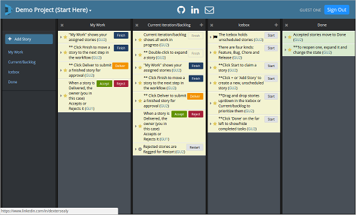
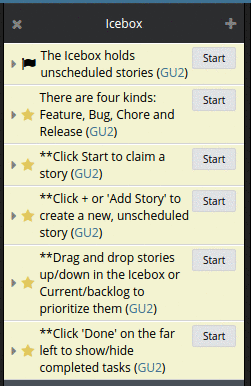
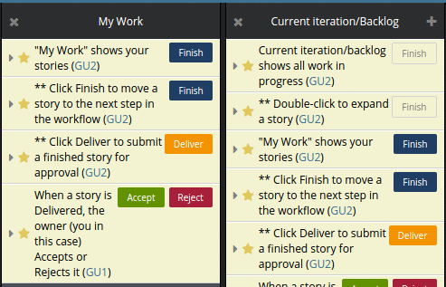

# Project Tracker

Project Tracker ([Live](http://projecttracker.dextersealy.com)) is a full-stack web application that keeps agile teams in sync. It's modeled after [Pivotal Tracker](http://www.pivotaltracker.com). The back-end uses Ruby on Rails and Postgresql. The front-end uses a React/Redux framework, and leverages the Pusher service for real-time notifications.



## Contents

- [What it Does](#what-it-does)
  - [Projects, Stories and Tasks](#projects-stories-and-tasks)
  - [Real-time Push Notifications](#real-time-push-notifications)
- [How it Does It](#how-it-does-it)
  - [Back-end](#back-end)
    - [Schema](#schema)
    - [ActiveRecord Models](#activerecord-models)
    - [Controllers](#controllers)
  - [Front-end](#front-end)
    - [Routes](#routes)
    - [Components and State](#components-and-state)
- [License](#license)

## What it Does

### Projects, Stories and Tasks

Project Tracker consists of three major objects: projects, stories and tasks. A ***story*** is any intermediate project deliverable. It can be a new feature, a bug fix, a maintenance chore, or a release milestone. A ***project*** is a collection of stories that are worked on together by the project's members. Stories can have ***tasks*** that represent intermediate steps to be checked-off as they are completed.

The main application interface is a configurable, real-time project dashboard, where you create and edit stories and track their progress through the development pipeline. The dashboard has four sections:

- Stories start off in an ***Icebox*** that holds anticipated deliverables
- When work commences on a deliverable, it moves to ***Current iteration/backlog***
- When a deliverable is finished and accepted, it moves to ***Done***
- ***My Work*** lists the logged in user's current deliverables

### Real-time Push Notifications

When you make a change in Project Tracker it notifies other running instances and propagates changes in real-time. Everyone always sees the same up-to-date view of the project.

## How it Does It

### Back-end

Project Tracker's back end is written in Ruby and uses the Rails framework. That data is stored in a Postgresql database.

#### Schema

User and session information are maintained by two tables:
- **users**: stores user profiles and password digests
- **sessions**: tracks active sessions so users can log in simultaneously from multiple locations

Information about stories, projects and tasks are stored in these tables:
- **stories**: the `project_id` column associates stories with projects
- **tasks**: contains a similar `story_id` column linking tasks to stories
- **projects**: contains only the project title; there are no foreign keys
- **memberships**: this join table associates users with projects and their level of access (e.g., *owner*, *member* or *viewer*).

#### ActiveRecord Models

Each table has an associated ActiveRecord model that validates changes and removes dependent rows when the primary relation is deleted. The **Memberships** model uses a scoped relation to identify project owners and the project they own. E.g.,

```ruby
class Membership < ApplicationRecord
  belongs_to :user
  belongs_to :project
  scope :owned, -> { where(role: 'owner') }
end

class Project < ApplicationRecord
  has_many :ownerships, -> { owned }, class_name: 'Membership'
  has_many :owners, through: :ownerships, source: :user
end

class User < ApplicationRecord
  has_many :ownerships, -> { owned }, class_name: 'Membership'
  has_many :owned_projects, through: :ownerships, source: :project
end
```

#### Controllers

A typical assortment of Rails controllers implement the back-end API. Two controllers are internal plumbing:
- **StaticPages**: renders the root page that bootstraps the web application with the current user's identity
- **Pusher**: implements the authentication endpoint for [Pusher](https://pusher.com/) real-time notifications.

The remaining controllers implement the RESTful API. To prevent malicious attacks they all limit the current user's view/actions to what she's authorized to see/do.

- **Users**: has a single action for creating new accounts.
- **Sessions**: has actions to create and destroy active sessions (i.e., log in/out).
- **Projects**: has CRUD (**C**reate, **R**ead, **U**pdate, and **D**elete) actions for projects.
- **Tasks**: contains CRUD actions for tasks.
- **Stories**: has CRUD actions for stories, plus index and show actions that respectively return all the stories in a project, and all the data for one story (including its tasks). Stories also implements a ***prioritize*** action the front-end uses to reorder deliverables:

  

The controllers use after actions to push notifications to interested subscribers. E.g.,
```ruby
class StoriesController < ApplicationController
  after_action :push_mod_notification, only: [:create, :update]
  after_action :push_del_notification, only: [:destroy]
  after_action :push_prioritize_notification, only: [:prioritize]
end
```
## Front end

Project Tracker's front-end uses React with Redux for its framework.

### Routes

The application's entry point renders the ***Root*** component. It wraps the main ***App*** component within the store provider and hash router. App in turn defines these routes:

Route | Purpose
---|---
 `/signin`<br>`/login`<br>`/logout` | manage user sessions
 `/projects` | implements the dashboard where you create, edit and delete projects
 `/project/:id` | implements the main project view UI

### Components and State

The Redux state contains the logged in user's identity, her projects, and the selected project's stories. E.g.,

```javascript
{
  session: {
    currentUser: {
      id: 10,
      email: "guest1@dsealy.com",
      ...
    },
  },
  projects: {
    96: {
      id: 96,
      role: "owner",
      title: "Demo Project (Start Here)",
      ...
    }
  },
  stories: {
    699: {
      id: 699,
      kind: "feature",
      state: "started",
      title: "Current iteration/backlog shows all work in progress",
      ...
    },
    ...
  },
}
```

**\<Project>** implements the main project view UI. It renders a **\<NavPanel>** component for the left-size navigation, and renders one **\<StoryPanel>** component for each other visible section. **Project** decides what to display where -- it passes a filtered list of stories to StoryPanel as props.

StoryPanel renders a **\<PanelHeader>** and a **\<StoryIndex>**. StoryIndex in turn renders one **\<StoryItem>** for each story in the panel. If the story is expanded, the StoryItem renders a **\<StoryForm>**; otherwise it renders the story details directly.

A story can appear in more than one panel and stories move between panels depending on their state. For this reason, **StoryForm** does not maintain any internal state. When you edit a story, it instead dispatches state changes that are picked up and rendered by **\<Project>**.

Thus, if a story is displayed in multiple panels, Project Tracker show the edits in all places simultaneously:



## License

Project Tracker Copyright (c) Dexter Sealy

Project Tracker is free software; you can distribute it and/or modify it subject to the terms of the [MIT license](https://opensource.org/licenses/MIT).
.
